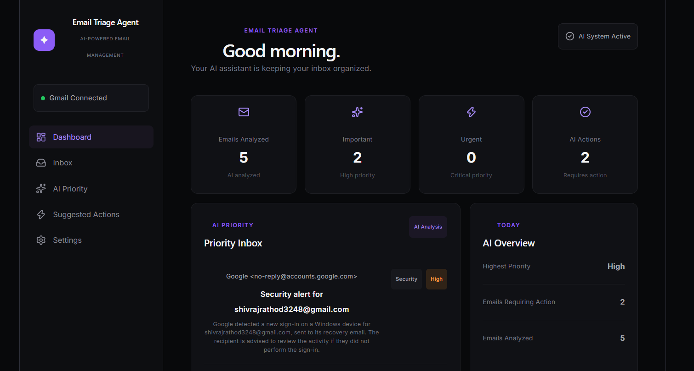
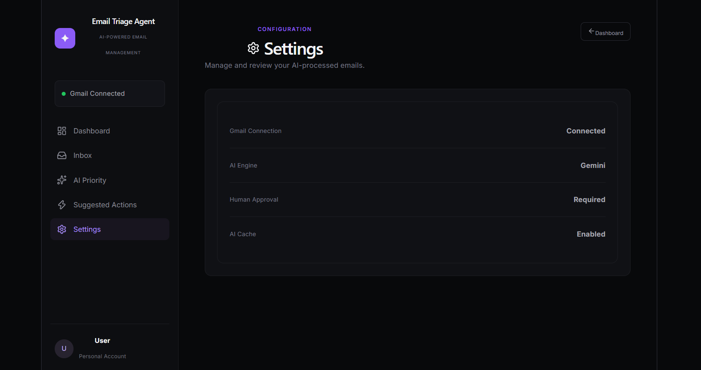
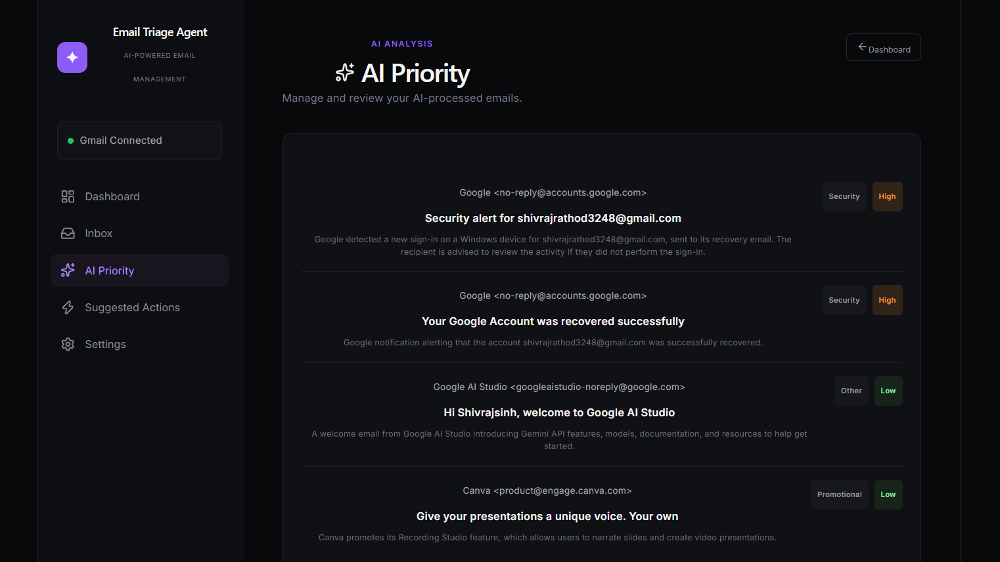

# 📧 Email Triage Agent

An AI-powered email management and triage system that connects to Gmail, analyzes incoming emails using Google Gemini, automatically categorizes and prioritizes them, and presents the results through a modern React dashboard.

The goal is simple: **turn a crowded inbox into an organized, actionable view while keeping the user in control.**

---

## ✨ Features

### 📬 Gmail Integration

* Connects directly to Gmail using Google OAuth 2.0.
* Fetches real emails from the user's Gmail inbox.
* Extracts sender, subject, date, body, message ID, and thread ID.

### 🤖 AI-Powered Email Analysis

Each email is analyzed using Google Gemini.

The AI determines:

* **Category**

  * Important
  * Work
  * Academic
  * Personal
  * Promotional
  * Newsletter
  * Social
  * Security
  * Other

* **Priority**

  * Critical
  * High
  * Medium
  * Low

* Whether the email **requires action**

* A short **AI-generated summary**

* The reason behind the assigned priority

### ⚡ Smart Caching

AI results are stored locally using SQLite.

This prevents the same email from being analyzed repeatedly and helps reduce unnecessary Gemini API usage.

### 📊 Dashboard

The React dashboard provides:

* Emails analyzed
* Important emails
* Urgent emails
* Emails requiring action
* AI priority inbox
* AI overview
* Recent inbox
* Gmail connection status

### 🧑‍💻 Human-in-the-Loop

The system is designed around a human-control principle:

> **AI recommends. The user decides.**

AI analysis does not automatically modify the user's Gmail account.

### 🎨 Modern Web Interface

The frontend is built with React and provides:

* Dashboard
* Inbox
* AI Priority
* Suggested Actions
* Settings
* Responsive email cards
* Priority indicators
* AI analysis summaries

---

## 🏗️ System Architecture

```text
                    ┌──────────────────┐
                    │      Gmail       │
                    │      API         │
                    └────────┬─────────┘
                             │
                             ▼
                    ┌──────────────────┐
                    │  FastAPI Backend │
                    └────────┬─────────┘
                             │
                ┌────────────┴────────────┐
                │                         │
                ▼                         ▼
       ┌──────────────────┐      ┌──────────────────┐
       │  Gmail Service   │      │  Gemini AI       │
       │                  │      │  Analysis        │
       └──────────────────┘      └────────┬─────────┘
                                          │
                                          ▼
                                ┌──────────────────┐
                                │  SQLite Cache    │
                                │                  │
                                │  email_analysis  │
                                └────────┬─────────┘
                                         │
                                         ▼
                                ┌──────────────────┐
                                │  React Frontend  │
                                │                  │
                                │  Dashboard       │
                                │  Inbox           │
                                │  AI Priority     │
                                │  Actions         │
                                │  Settings        │
                                └──────────────────┘
```

---

## 🛠️ Tech Stack

### Backend

* Python
* FastAPI
* Uvicorn
* Google Gmail API
* Google OAuth 2.0
* Google Gemini
* SQLite
* Pydantic
* python-dotenv

### Frontend

* React
* Vite
* JavaScript
* CSS
* Lucide React

### Development

* Git
* GitHub
* VS Code

---

## 📁 Project Structure

```text
Email Triage Agent/
│
├── app/
│   ├── __init__.py
│   ├── main.py
│   ├── database.py
│   │
│   ├── models/
│   │   └── email.py
│   │
│   └── services/
│       ├── ai_service.py
│       ├── gmail_service.py
│       ├── triage_service.py
│       ├── test_ai.py
│       ├── test_gmail.py
│       └── test_triage.py
│
├── frontend/
│   ├── public/
│   ├── src/
│   │   ├── App.jsx
│   │   ├── App.css
│   │   ├── api.js
│   │   ├── index.css
│   │   └── main.jsx
│   │
│   ├── package.json
│   ├── package-lock.json
│   └── vite.config.js
│
├── .gitignore
├── .env.example
└── README.md
```

---

## 🚀 Getting Started

### 1. Clone the repository

```bash
git clone https://github.com/ShivrajsinhRathod/Email-Triage-Agent.git
```

Move into the project:

```bash
cd Email-Triage-Agent
```

---

# ⚙️ Backend Setup

## 2. Create a Python virtual environment

### Windows

```powershell
python -m venv venv
```

Activate it:

```powershell
.\venv\Scripts\Activate.ps1
```

If PowerShell blocks activation, you can use:

```powershell
venv\Scripts\activate
```

---

## 3. Install Python dependencies

Install the required packages:

```powershell
pip install fastapi uvicorn python-dotenv pydantic google-api-python-client google-auth-httplib2 google-auth-oauthlib google-genai
```

---

## 4. Configure Gemini

Create a `.env` file in the project root:

```env
GEMINI_API_KEY=your_gemini_api_key
```

**Never commit your `.env` file or API key to GitHub.**

---

# 📬 Gmail API Setup

The application uses Gmail API with Google OAuth 2.0.

### 1. Create a Google Cloud project

Go to Google Cloud Console and create a project.

### 2. Enable Gmail API

Enable:

```text
Gmail API
```

### 3. Create OAuth credentials

Create an OAuth Client ID for a desktop application.

Download the credentials file and place it in:

```text
credentials.json
```

inside the project root.

Example:

```text
Email Triage Agent/
├── credentials.json
├── .env
├── app/
└── frontend/
```

### 4. Authenticate

When the application accesses Gmail for the first time, Google OAuth authentication will be initiated.

After successful authentication, a local:

```text
token.json
```

file is created.

**Do not upload `credentials.json` or `token.json` to GitHub.**

---

# ▶️ Running the Backend

From the project root:

```powershell
uvicorn app.main:app --reload
```

The backend will run at:

```text
http://127.0.0.1:8000
```

You can check the API:

```text
http://127.0.0.1:8000/
```

Health check:

```text
http://127.0.0.1:8000/health
```

---

# 🎨 Frontend Setup

Open another terminal.

Move into the frontend:

```powershell
cd frontend
```

Install dependencies:

```powershell
npm install
```

Start the development server:

```powershell
npm run dev
```

The frontend will normally be available at:

```text
http://localhost:5173
```

---

# 🔌 API Endpoints

| Method | Endpoint  | Description                 |
| ------ | --------- | --------------------------- |
| GET    | `/`       | API status                  |
| GET    | `/health` | Health check                |
| GET    | `/emails` | Fetch recent Gmail emails   |
| GET    | `/triage` | Fetch and AI-analyze emails |

Example:

```text
GET /triage?limit=5
```

Response structure:

```json
{
  "count": 5,
  "results": [
    {
      "email": {
        "id": "email_id",
        "sender": "sender@example.com",
        "subject": "Example email",
        "date": "date",
        "body": "Email content"
      },
      "analysis": {
        "category": "Work",
        "priority": "High",
        "requires_action": true,
        "summary": "The email contains an important work request.",
        "reason": "The email requires a response."
      }
    }
  ]
}
```

---

# 🧠 How Email Triage Works

The current processing flow is:

```text
Gmail
  │
  ▼
Fetch Email
  │
  ▼
Check SQLite Cache
  │
  ├── Cached ──────────────► Use Existing Analysis
  │
  └── Not Cached
          │
          ▼
      Gemini AI
          │
          ▼
      JSON Analysis
          │
          ▼
      Save to SQLite
          │
          ▼
      React Dashboard
```

This architecture avoids repeatedly sending the same email to the AI model.

---

# 🔐 Security

Sensitive files are excluded from Git using `.gitignore`.

The following files should **never** be committed:

```text
.env
credentials.json
token.json
venv/
node_modules/
email_triage.db
```

If you accidentally expose an API key or OAuth credential, revoke or rotate it immediately.

---

# 🧪 Testing

Backend service tests are located in:

```text
app/services/
```

Examples:

```powershell
python -m app.services.test_ai
```

```powershell
python -m app.services.test_gmail
```

```powershell
python -m app.services.test_triage
```

---

# 🗺️ Current Status

### Implemented

* [x] Gmail OAuth integration
* [x] Gmail email fetching
* [x] Gemini AI integration
* [x] Email categorization
* [x] Priority classification
* [x] Action detection
* [x] AI summaries
* [x] AI reasoning
* [x] SQLite AI caching
* [x] FastAPI backend
* [x] React frontend
* [x] Dashboard
* [x] Inbox view
* [x] AI Priority view
* [x] Suggested Actions view
* [x] Settings view
* [x] Human-in-the-loop concept

### Planned

* [ ] Email detail view
* [ ] Search and filtering
* [ ] Pagination
* [ ] Gmail archive action
* [ ] Mark as read/unread
* [ ] Delete email
* [ ] Draft/reply assistance
* [ ] Approval workflow for Gmail actions
* [ ] AI confidence indicators
* [ ] Production deployment

---

# 🎯 Project Goal

Email Triage Agent is designed to reduce the time users spend manually sorting and understanding their inbox.

Instead of treating every email equally, the system uses AI to identify:

```text
What is this email?
        ↓
How important is it?
        ↓
Does it require action?
        ↓
What should the user know?
```

The final decision remains with the user.

---

# 📌 Future Vision

The long-term goal is to evolve Email Triage Agent from an email classifier into a complete **AI-assisted inbox management platform**.

Potential capabilities include:

* Intelligent email search
* Automated inbox organization
* AI-generated replies
* Meeting and deadline detection
* Follow-up reminders
* Important-email monitoring
* User-defined automation rules
* Approval-based Gmail actions
* Personalized triage preferences

---

## 👨‍💻 Author

**Shivrajsinh Rathod**

GitHub:

https://github.com/ShivrajsinhRathod

---

## 📄 License

This project is currently intended for development and educational purposes.

## 📸 Screenshots

### Dashboard



### Inbox



### AI Priority


